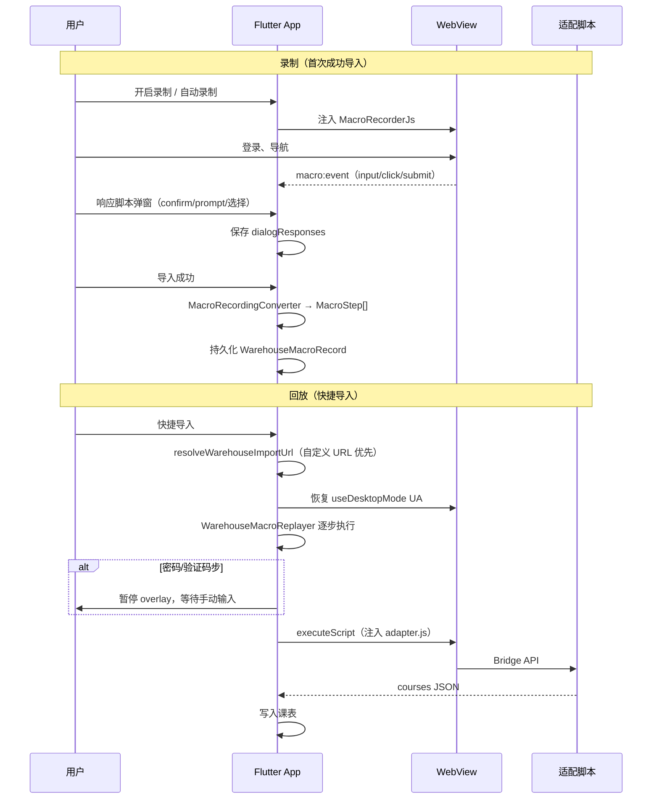

# 教务快捷导入（宏录制 / 回放）设计说明

## 文档信息

| 项目 | 内容 |
|------|------|
| 功能名称 | 快捷导入（Warehouse Macro Quick Import） |
| 创建日期 | 2026-06-28 |
| 状态 | 已实现（持续迭代） |
| 关联方案 | [qingyu_warehouse 接入方案](./2026-04-05-qingyu-warehouse-integration-plan.md) |

---

## 一、用户故事

> 我已经成功从某校教务系统导入过一次课表。下次我想点「快捷导入」，App 自动打开登录页、填充学号、等我输入验证码/密码后自动登录，并执行该校的导入脚本，无需重复手动操作。

---

## 二、范围与边界

### 2.1 包含

| 能力 | 说明 |
|------|------|
| 录制 | 在 WebView 登录流程中记录点击、填表、表单提交等 DOM 操作 |
| 回放 | 按步骤自动重放登录路径，并在末尾注入仓库适配 JS 执行导入 |
| 脚本弹窗 | 录制用户对 `confirm` / `prompt` / `singleSelection` 的响应，回放时自动匹配 |
| 敏感字段 | 密码、验证码不写入宏 JSON，回放时暂停等待用户手动输入 |
| 桌面 / 移动 UA | 录制时选择的 WebView 模式会随宏一并保存，回放时恢复 |

### 2.2 不包含（除非用户重新录制）

- 复杂多页导航（未在录制中出现的路径）
- 教务网站大幅改版后仍 100% 可用（需重新录制或改用手动导入）
- 跨设备同步宏（当前仅存本机 SharedPreferences）

### 2.3 与 warehouse 接入方案的关系

快捷导入属于 **「登录与导入交互层」** 的增强，不替代仓库协议层或脚本执行层：

```
仓库索引 / adapters.yaml  →  选择学校与适配器
        ↓
WebView 登录（可录制宏）  →  注入 adapter.js
        ↓
Bridge API 返回课程 JSON  →  映射为课表模型
```

宏只负责 **「如何到达可执行脚本的登录态」**；课程解析仍由仓库 JS 适配器完成。

---

## 三、录制 / 回放流程



---

## 四、失败模式与降级

| 场景 | 行为 |
|------|------|
| 某步 DOM 选择器找不到 | 回放失败，overlay 显示错误；用户可关闭 overlay 改用手动操作 |
| 回放 overlay 被隐藏 | 用户可在 WebView 内继续手动登录与导入 |
| 无录制的 singleSelection 响应 | **不再**静默选第一项；弹出选择框让用户确认 |
| 密码/验证码 | 始终 `waitForManualInput`；可配合「记住登录」自动填充密码 |
| 教务 URL 变更 | 用户可在适配器详情设置自定义 import URL；快捷导入会优先使用该 URL |
| 宏步骤为空 | 提示重新录制 |

---

## 五、安全与隐私

| 数据 | 存储位置 | 说明 |
|------|----------|------|
| 密码 | **不存储**于宏 JSON | 录制时转为 `waitForManualInput`；可选存于 Secure Storage（记住登录） |
| 验证码 | **不存储** | 每次回放需用户输入 |
| 学号 / 用户名 | 宏 `fillField` 或 SharedPreferences | 非敏感，可写入步骤 JSON |
| dialogResponses | 宏 JSON | 仅存用户确认过的选项文本/布尔值，不含凭证 |
| 宏整体 | SharedPreferences | 本机本地，不上传 |

---

## 六、关键实现文件

| 文件 | 职责 |
|------|------|
| `lib/models/warehouse_macro_models.dart` | `MacroStep`、`WarehouseMacroRecord`、`warehouseDialogResponseKey` |
| `lib/widgets/warehouse_macro_recorder.dart` | 录制 JS、`MacroRecordingConverter` |
| `lib/widgets/warehouse_macro_replayer.dart` | 回放引擎、进度回调 |
| `lib/widgets/warehouse_playback_overlay.dart` | 回放进度 UI |
| `lib/services/warehouse_macro_service.dart` | 宏持久化 |
| `lib/services/warehouse_import_preferences_service.dart` | 自定义 URL、`resolveWarehouseImportUrl` |
| `lib/screens/course_import_screen.dart` | WebView 宿主、Bridge、录制/回放入口 |

---

## 七、回放健壮性策略

1. **Converter**：`click` 后插入 800ms `delay`；`submit` 后 2500ms `delay`，给页面导航留时间。
2. **Replayer**：`click` / `fillField` 后调用 `_waitForPageReady`（URL + `document.readyState`）。
3. **dialogId**：Bridge `singleSelection` 支持可选 `dialogId`，用于稳定匹配 `dialogResponses`（适配脚本可按需传入）。

---

## 八、后续可选改进

- 录制开始时自动插入 `navigate(initialUrl)` 步
- 宏版本号与教务站点 fingerprint，便于提示「可能已过期」
- 导出/导入宏 JSON（跨设备，需注意不含密码）
